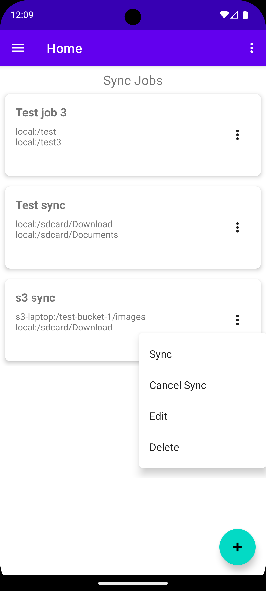
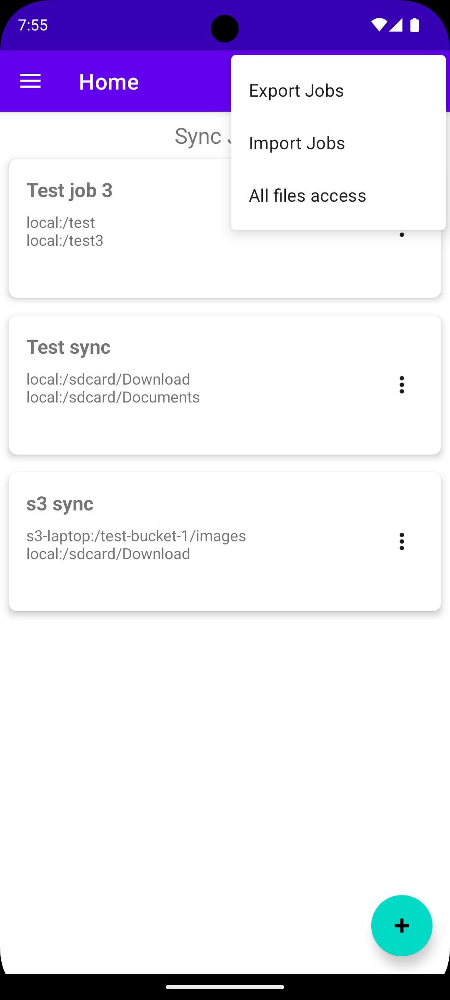

# rclone-sync-app
RClone Sync App - An android app for sync management.

## Description
An android app for seemless syncing from different remote sources and destinations.

### Features
- Import rclone config file
- Define sync jobs
- Perform syncs
- View sync status
- Import/export job configs

## Screenshot

## Usage Instructions
Download and install the apk from the releases
[releases](https://github.com/mtseet/rclone-sync-app/releases) page.

Click top right settings menu and enable All file access.

Import your rclone config file.

Define a Job.

Use the Job menu to start syncing. You can cancel a sync any time.

## Acknowledgements
Uses native libraries copyright to 
[Rclone](https://github.com/rclone/rclone).

RClone integration method first proposed by 
[RCX](https://github.com/x0b/rcx) is used.

Another project that served as insperation for this project is
[Round Sync](https://github.com/newhinton/Round-Sync).

## Support
You can buy me a coffee if you like this software

